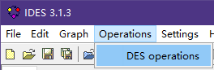
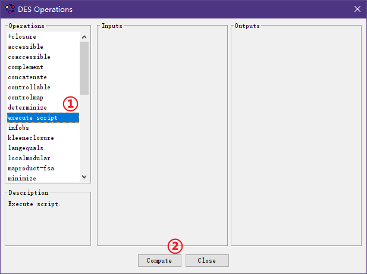
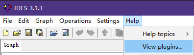
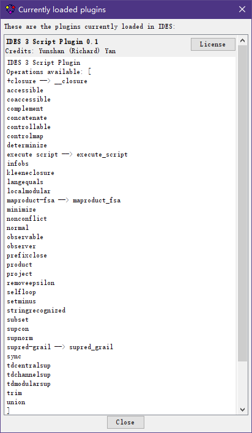

# IDES3script

A [IDES3](https://github.com/krudie/IDES) plugin
to add scripting capability.

Currently, the plugin supports scripting with [JavaScript](https://www.javascript.com/),
with FSA specified in [YAML](https://yaml.org/) format.

Since the scripting capability relies on [GraalVM](https://www.graalvm.org/),
it is possible to support other scripting languages besides JavaScript.
Contributions are welcomed!

# Getting Started

## Prerequisites

Current version (v0.2.0) requires:

- JRE: v17
- [IDES3](https://github.com/krudie/IDES): v3.1.3
- [Graaljs](https://mvnrepository.com/artifact/org.graalvm.js/js/20.3.0): v20.3.0

This plugin requires JRE v17.

The plugin is developed for IDES3 v3.1.3.
It is not known at all whether the plugin works with IDES3 of a higher or lower version.

The plugin assumes GraalJS v20.3.0 is present (see [Installing](#Installing)).
It is not known at all whether the plugin works
if GraalJS of a different version is present.

## Installing

Assuming you have the required tool, otherwise see

- [IDES3 installation](https://github.com/krudie/IDES#installation)

Assuming `./` refers to the root path of your IDES3 installation,
i.e., where `IDES-[VERSION].jar` is located.

Download the file [`IDES3script.IDES3script.jar` (link)](https://github.com/RichardYan314/IDES3script/releases)
and place it under `./plugins`.
Download the file `js-20.3.0.jar` either from
[the official link](https://repo1.maven.org/maven2/org/graalvm/js/js/20.3.0/js-20.3.0.jar)
or from [this repo](https://github.com/RichardYan314/IDES3script/releases)
and place it under `./lib`.

## Usage

Launch IDES3!

From the toolbar, click through `Operations -> DES Operations`:



In the dialog, locate the operation `execute script` and click compute.



Locate your JavaScript script in the new dialog.

## API

The plugin creates some necessary functions and expose them
as functions of the object `IDES`.

For more advanced purposes,
the [IDES3 `Hub` (link to source code)](https://github.com/krudie/IDES/blob/master/src/main/java/ides/api/core/Hub.java),
is exposed as the JavaScript object `Hub`.
The Hub is the core of the IDES3 API,
and according to the JavaDoc, it
"serves to get references to all objects of interest (such as settings, main window, loaded resources, etc.)"

Before there is an online JavaDoc of the `Hub` and other IDES3 classes,
you have to obtain a copy
by downloading the IDES api matching your version of IDES3
from its [official site](https://github.com/krudie/IDES/releases),
unzipping the `IDES-[VERSION]-api.zip` and the entrance of the JavaDoc
is at `docs/api/index.html`. 

### Declaring FSA

FSA are declared in YAML format.
Following is a minimalistic example with all possible fields.

```yaml
name: G
desc: "this is a commentary description for your self"
layouter: "JGraph organic layout"
spec:
  start states: 1
  marked states: 1
  epsilon: e
  controllable: \alpha
  observable: \alpha
  table:
    1:
      \alpha: 1
```

- `name`: The name of the FSA.
- `desc`: A commentary description of the FSA for your self.

    This field is reserved so that the plugin will never look into this field.
    
- `layouter`: The layout algorithm for the FSA. This field is not necessary.    
- `spec`: The specification of the FSA. It has the following fields:
  + `start states` (`start state`): The start states of the FSA.
    
    This field can be spelt as both plural and singular.
    If both fields `start states` and `start state` are present, 
    the plural takes precedence.
    
    Can be specified either as a singleton 
    (e.g., `1` or `"q_0"`), or as a list (e.g., `[1,2,3]`).
     
  + `marked states` (`marked state`): The marked states of the FSA. 
  
    This field can be spelt as both plural and singular.
    If both fields `marked states` and `marked state` are present, 
    the plural takes precedence.
    
    Can be specified either as a singleton 
    (e.g., `1` or `"q_0"`), or as a list (e.g., `[1,2,3]`).
    
  + `epsilon`: the symbol for epsilon transition (e.g., `e` or `epsilon` or `\epsilon`).
     
  + `controllable`: The controllable events of the FSA. 
    
    Events are uncontrollable by default.
    
    Can be specified either as a singleton 
    (e.g., `a` or `\alpha`), or as a list (e.g., `[\alpha,\beta,\gamma]`).
     
  + `observable`: The observable events of the FSA.
  
    Events are observable by default.
    
    Can be specified either as a singleton 
    (e.g., `a` or `\alpha`), or as a list (e.g., `[\alpha,\beta,\gamma]`).
    
  + `table`: The transition table of the FSA.
  
    The table contains a list of key-value pairs,
    where each key is the source state of the transitions specified by its value,
    and the value is in turn another list of key-value pairs,
    with each key an event and the value of the target states.
    
    The target states can be specified either as a singleton 
    (e.g., `1` or `"q_0"`), or as a list (e.g., `[1,2,3]`).
    
A state/event can be specified both as an integer or as a quoted string.
They will be represented internally as strings,
hence the state `1` and the state `"1"` are the same.
Notice that YAML has some peculiar rules to allow you omitting the quotations occasionally,
so instead of writing `"q_0"` you might be able to write `q_0` instead.

If you have configured your IDES3 to use LaTeX,
you can pass latex commands as strings.
So the event `\alpha` can be rendered as $\alpha$.

You can declare an FSA with `IDES.declare("[YAML SPEC HERE]")` in your script,
with the necessity to escape characters properly (so that instead of `\alpha`, you need `\\alpha`).
To avoid the trouble of escaping,
you can place the YAML spec in a separate file,
say `spec.yml`,
and use `IDES.importYAML("spec.yml")` instead.
The directory is relative to the script itself.

With either `IDES.declare` or `IDES.import`,
the FSA will be opened in the workspace with the name you declared in the field `name`.
If there are duplicated names, IDES will append something like ` (1)` to the end of the name
of the later declared FSA.

You may want to bind the declared FSA to a variable for later use,
like `G = IDES.importYAML("spec.yml")`.
Although the plugin does provide API to get model by name,
biding models to variables is considered more predictable since IDES3 can rename models to avoid duplicated names.

### Invoking DES Operations

The plugin tries its best to expose DES Operations as JavaScript function calls.
However, this is not always possible,
since names of some operations are not legal JavaScript identifiers.

For example,
the line `Gp = product(G1, G2, G3)`
computes the product of three automata,
adds the result to the workspace,
and binds the result to `Gp`.


However, for an operation like the `+-closure`,
since the name is not a legal JavaScript identifier,
one cannot write `Gp = +-colsure(G)`.

There are two ways around this problem.

First, the plugin attempts to bind the operations to legal JavaScript identifiers,
so the operation `+closure` can be invoked as `__closure`.
Another example is that the operation `maproduct-fsa` can be invoked as `maproduct_fsa`.

For a comprehensive list of JavaScript bindings of DES operations,
go the toolbar, click through `Help -> View plugins...`:



In the `Currently loaded plugins` window,
find the description of this plugin (`IDES 3 Script Plugin`).



The description contains a list of JavaScript bindings of DES operations.
A line in the form of `xxx -> yyy` reads the DES operation `xxx`
is bind to JavaScript identifier `yyy`,
where the renaming is to satisfy JavaScript identifier format.
A line in the simple form of `xxx` means the operation is bind to JavaScript identifier
`xxx` without the need of renaming.

Notice that the remaings are generated automatically,
so that they might appear to be odd,
like in the case of `__closure`.

#### Invoking DES Operations (Low-level)

Very rarely,
the first approach can fail if two operations are renamed identically,
in which case the latter operation's binding overwrites the first one.
Moreover, which operation comes later are not necessarily determined.
In such cases you can still rely on the following low-level command to access the operations:

```js
outputs = IDES.operation("product", G, S)
SG = outputs[0]
```

The first argument to `IDES.operation` is the name of the DES operation internal to IDES3,
hence can legally be `+closure`.

The remaining arguments are passed directly to the DES operation.

The plugin will automatically assign a meaningful name to the output.
In the example above,
the plugin will try naming the output as `product(G, S)`,
if the FSA `G` and `S` are named `G` and `S`, resp.
Of course, this will then be subject to the renaming of IDES3 to avoid duplicates.

`IDES.operation` always returns a list of outputs, all added to the workspace.
If you are certain that your operation returns only one model,
you can use the function `IDES.operation1` instead,
which will automatically unpack the list for you.
Hence, the example above can be more compactly written as:

```js
SG = IDES.operation1("product", G, S)
```

### Working on Models Directly

One strength of this plugin is with it,
you are able to implement DES operations as scripts,
rather than as plugins to IDES3 (like this plugin is).

The general workflow is illustrated in the following JavaScript snippet:

```js
Gp = G.clone() // or create a new model
// do something to Gp
Gp.setName("G'") // you can invoke Java code!
IDES.addModel(Gp)
```

In line 1, either clone an existing model, or create a new, empty one.

Then do some things to your model, in JavaScripts,
with all the Java methods avaliable!
For example, line 3 shows that you can invoke the
[Automaton#setName(String)](https://github.com/krudie/IDES/blob/94bf1188e52faba85880c74c1b66fc2e6d24694d/src/main/java/model/fsa/ver2_1/Automaton.java#L309)
method in JavaScript.

Finally, unless the model is intermediate to a larger computation and you don't need to see it,
you can call `IDES.addModel`, as shown in line 4,
to add the model to the workspace. 

Obviously, you still need to understand some code of IDES3.
But at least you now have the choice of not using Java!

There are, however, some pitfalls.
Sometimes modifying a model that has been added to the workspace,
or a model cloned from such, can fail.
This is because we are only modifying the model,
but not its associated graph layout elements.
In this case two things have to be done:
the first is obviously also to modify the associated graph layout elements,
and the second is to trigger a redraw of the graph.
Given the current implementation of IDES3 and its API,
it seems the redraw can only be triggered by removing the model from the workspace
and adding it back.

For an example, see [the Cat and Mouse Problem](examples/Cat%20and%20Mouse%20Problem)

### Setting Layout

If you want to use a specific layout algorithm,
you have to specify it before adding the model to the workspace.
Once a model is added to the workspace,
it is quite hard to programmatically (although possible) change the layouter.
Remember you still have the option to manually experiment the layouters
by selecting in the `Graph -> Layout` menu.

When using `IDES.importYAML` and `IDES.declare` functions,
the layouter can be specified in the YAML document
(see [Declaring FSA](#Declaring FSA)).
Otherwise you can use `IDES.setDefaultLayouter("[name of the layouter]")`
to change the default layouter globally before you add a model to the workspace\
(either by a call to `IDES.addModel` or invoking a DES operation).
Notice that the effect will last even after adding a model.


## Versioning

The project is first published under the version v0.1.0.
As improvements being made, I will keep incrementing the MINOR and PATCH verion,
depending on the actual changes.

I will not increment the MAJOR version to `1` until the project
becomes satisfactory and ready to face massive users.

## Authors

* [**Richard Yan**](https://github.com/RichardYan314)

# License

This project is licensed under the GNU Affero General Public License license v3.0,
following the licensing of IDES3api.

See the [LICENSE.md](LICENSE.md) file for the full text.
